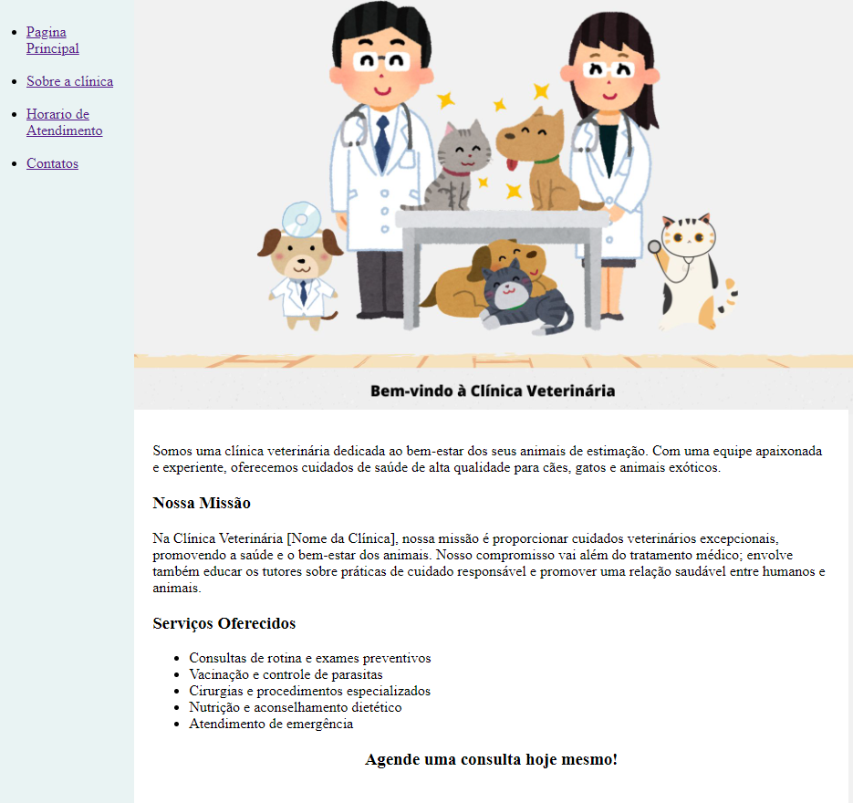
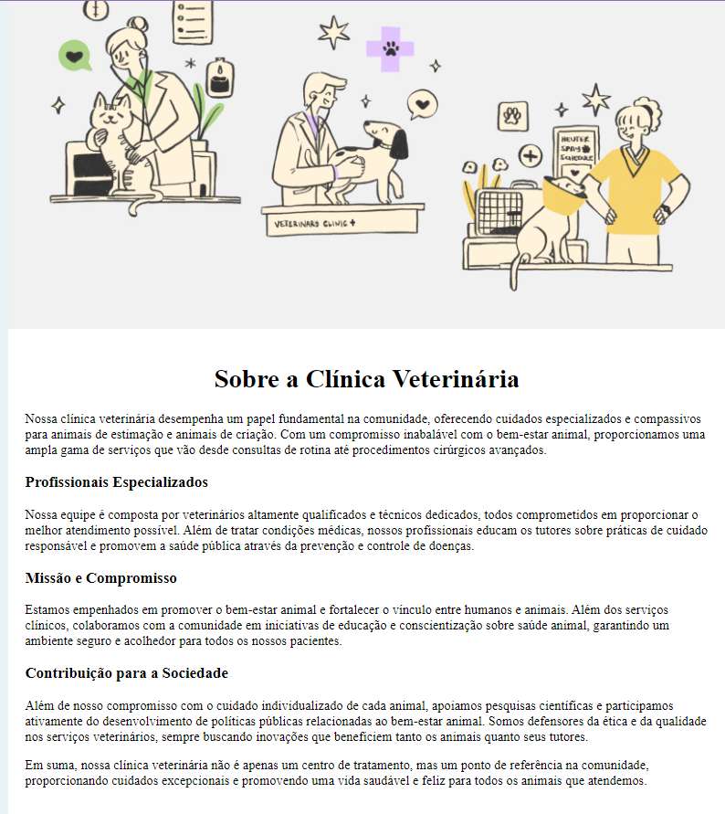
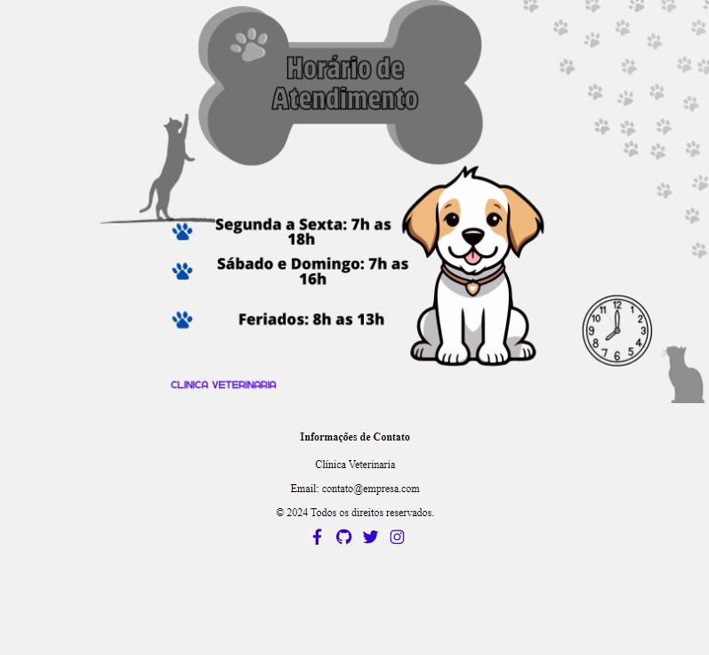
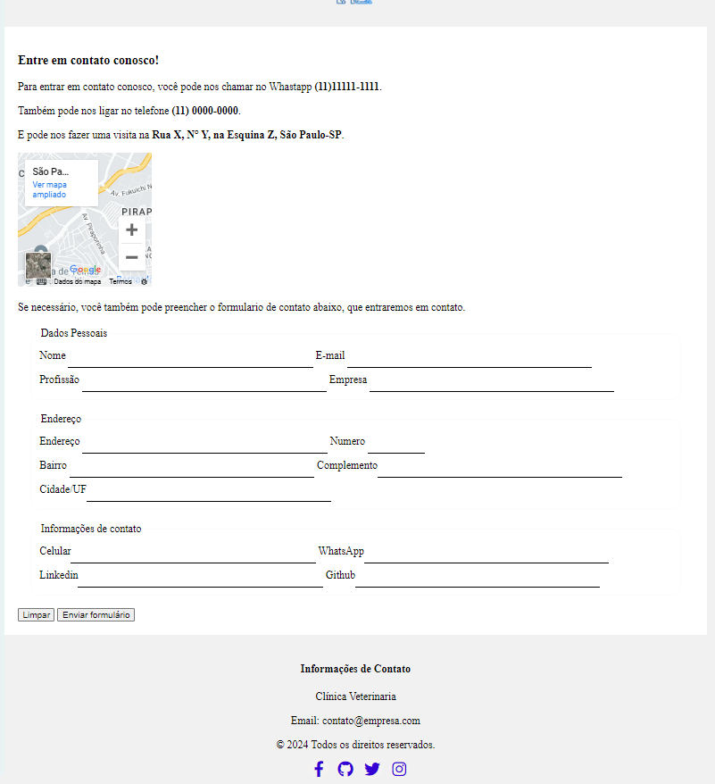

# Trilha HTML - Dio.me
## Módulo 02 - HTML I - Conceitos Básicos

## Instruções
1. Este projeto é simbolicamente de uma clínica veterinaria.
2. Este site contem menu de navegação:
    - Página Principal
    - Sobre a clínica
    - Horário de Atendimento
    - Contato

### Estrutura das páginas

Pagina Principal 

\*_Uma breve apresentação dos serviços fornecidos_

_No **Menu** ao lado está presente em todas as paginas e facilita a navegação entre os serviços._

### Sobre a clínica

_Um resumo breve resumo de como e onde a clinica trabalha._

### Horário de Atendimento

_Horario de atendimento de todos os dias da semana no consultorio._

### Contato

_Na parte de contato contem o mapa onde esta a localização da clinica, telefones para contato e um formulario para preencher e solictar outras informações ou consultas (localização, telefone e formulario apenas para ilustração)_

## Footer

Todas as paginas contém o footer.

### Desenvolvimento
Este projeto foi desenvolvido em HTML e CSS.